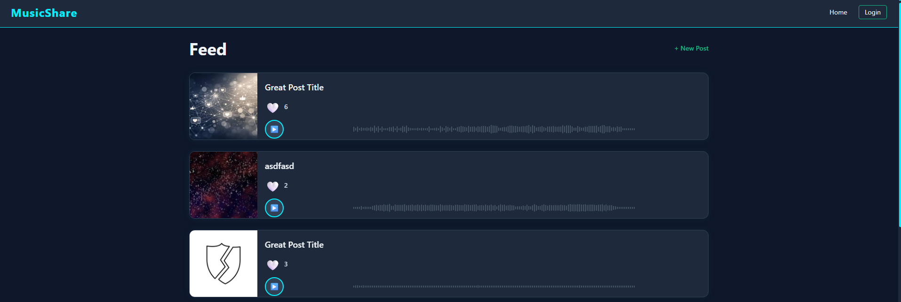
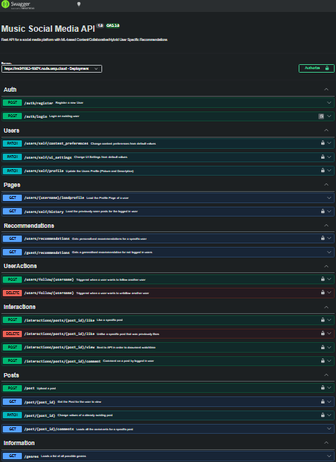

# [Music Social Media Platform](https://github.com/EngineerByEar/Music_Social_Media_Platform)

A social media platform built around music sharing. Users can upload original audio tracks, interact with other creators, and receive personalised recommendations based on their listening behaviour and preferences. I built the backend; a colleague built the frontend.


## 🎯 Overview

The platform lets users:

- Upload audio posts with cover images, tags, and genre labels
- Like, comment on, and track view-time for posts
- Follow other users and browse their profiles
- Receive personalised or guest-mode music recommendations
- Configure UI settings and content preferences per account
- See live like and view counts update in real time via WebSockets

## 📸 Interface
<p align="center" width="45%">
  
</p>

## 🏗️ System Architecture

The backend is a **Node.js / Express** REST API written in TypeScript, structured around a classic Controller → Service → Database pattern.

## 🤖 Recommendation System

Three recommendation modes are supported:

| Mode | Description |
|---|---|
| **Guest** | Returns the 10 most-liked posts globally |
| **Content-based** | Matches posts to a user's preferred genres and tags |
| **Collaborative** | Finds posts liked by similar users based on interaction history |

Users choose their preferred algorithm in account settings. The recommendation engine reads from a `contentpreferences` table per user and resolves post previews including pre-computed waveform data.


## 🔊 Waveform Generation

On every audio upload, the backend automatically generates a waveform for the frontend player:

1. FFmpeg (via `fluent-ffmpeg` + `ffmpeg-static`) decodes the audio to raw PCM at 8kHz mono
2. The PCM buffer is split into 1000 equal blocks
3. The peak amplitude of each block is normalised to a 0–255 `Uint8Array`
4. The result is stored in the `waveforms` table and returned as a Base64 string


## 📡 WebSocket Support

`PostController` runs a `ws` WebSocket server alongside the HTTP server. Clients can subscribe to a specific `post_id` and receive live broadcast messages when:

- A new like is added or removed (`like_count_updated`)
- A new view is recorded (`view_count_updated`)

```json
{ "type": "like_count_updated", "post_id": 42, "count": 137 }
```

---

## 🔌 API Endpoints

Fully documented in openapi format served at `/docs` (Swagger UI).

<p>
  
</p>

---

## 🔐 Authentication

JWT-based authentication using `jsonwebtoken`. The `validateAuth` middleware extracts and verifies a Bearer token on protected routes, attaching the decoded `username` to `req.params._username`. Some routes (e.g. profile view, post detail) accept an optional token to enrich the response — for example to indicate whether the requesting user has liked a post.

---

## 🛠️ Tech Stack

| Layer | Technology |
|---|---|
| Runtime | Node.js |
| Framework | Express |
| Language | TypeScript |
| Database | MySQL (via `mysql2`) |
| Auth | JWT (`jsonwebtoken`), bcrypt |
| File handling | Multer, Sharp |
| Audio processing | FFmpeg (`fluent-ffmpeg`, `ffmpeg-static`) |
| WebSockets | `ws` |
| Validation | Zod |
| API Docs | OpenAPI 3.0 / Swagger UI |

---

## 🚀 Possible Extensions

- Replace the placeholder collaborative filter with a proper matrix factorisation or neural model
- Add ML-based audio feature extraction (tempo, key, energy) to improve content-based matching
- Implement server-side pagination for recommendations and comment feeds
- Add post search by tag, genre, or artist
- Introduce a notification system for follows, likes, and comments
